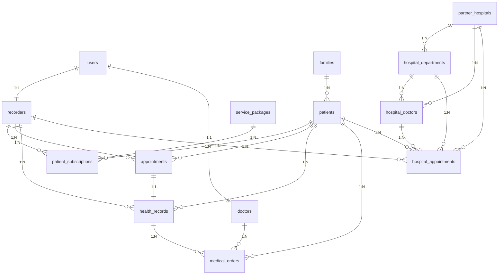

# 记录员小程序数据库设计文档

## 1. 概述

本数据库设计文档详细描述了记录员小程序后端服务的所有数据表结构，包括每个表的作用、字段含义、数据类型和约束条件。

## 2. 数据库表结构

### 2.1 用户与角色管理

#### users (用户表)
存储系统所有用户的基本信息，包括记录员、医生和管理员。

| 字段名 | 数据类型 | 约束 | 描述 |
|--------|----------|------|------|
| id | INT | PRIMARY KEY, AUTO_INCREMENT | 用户唯一标识符 |
| username | VARCHAR(50) | UNIQUE, NOT NULL | 用户名，用于登录 |
| phone | VARCHAR(20) | UNIQUE, NOT NULL | 手机号码，用于登录和联系 |
| password_hash | VARCHAR(255) | NOT NULL | 密码哈希值 |
| role | ENUM('recorder', 'admin', 'doctor') | NOT NULL | 用户角色：记录员、管理员、医生 |
| name | VARCHAR(100) | NOT NULL | 用户真实姓名 |
| avatar | VARCHAR(255) | NULL | 用户头像URL |
| status | ENUM('active', 'inactive', 'suspended') | DEFAULT 'active' | 用户状态：活跃、非活跃、暂停 |
| created_at | TIMESTAMP | DEFAULT CURRENT_TIMESTAMP | 创建时间 |
| updated_at | TIMESTAMP | DEFAULT CURRENT_TIMESTAMP ON UPDATE CURRENT_TIMESTAMP | 更新时间 |
| last_login | TIMESTAMP | NULL | 最后登录时间 |

#### recorders (记录员信息表)
存储记录员的详细职业信息。

| 字段名 | 数据类型 | 约束 | 描述 |
|--------|----------|------|------|
| id | INT | PRIMARY KEY, AUTO_INCREMENT | 记录员唯一标识符 |
| user_id | INT | NOT NULL, FOREIGN KEY (users.id) | 关联的用户ID |
| employee_id | VARCHAR(20) | UNIQUE, NOT NULL | 员工编号 |
| qualification_cert | VARCHAR(255) | NULL | 资格证件URL |
| health_cert | VARCHAR(255) | NULL | 健康证URL |
| cert_expiry_date | DATE | NULL | 证件过期日期 |
| work_area | TEXT | NULL | 工作区域（JSON格式） |
| is_on_duty | BOOLEAN | DEFAULT TRUE | 是否在职 |
| created_at | TIMESTAMP | DEFAULT CURRENT_TIMESTAMP | 创建时间 |

#### doctors (医生表)
存储医生的专业信息。

| 字段名 | 数据类型 | 约束 | 描述 |
|--------|----------|------|------|
| id | INT | PRIMARY KEY, AUTO_INCREMENT | 医生唯一标识符 |
| user_id | INT | NOT NULL, FOREIGN KEY (users.id) | 关联的用户ID |
| license_number | VARCHAR(50) | UNIQUE, NOT NULL | 执业许可证编号 |
| specialty | VARCHAR(100) | NOT NULL | 专业领域 |
| hospital | VARCHAR(100) | NULL | 所属医院 |
| department | VARCHAR(100) | NULL | 所属科室 |
| title | VARCHAR(50) | NULL | 职称 |
| consultation_fee | DECIMAL(8,2) | NULL | 咨询费用 |
| is_available | BOOLEAN | DEFAULT TRUE | 是否可预约 |
| created_at | TIMESTAMP | DEFAULT CURRENT_TIMESTAMP | 创建时间 |

### 2.2 患者与家庭管理

#### families (家庭表)
存储患者家庭的基本信息。

| 字段名 | 数据类型 | 约束 | 描述 |
|--------|----------|------|------|
| id | INT | PRIMARY KEY, AUTO_INCREMENT | 家庭唯一标识符 |
| family_name | VARCHAR(100) | NOT NULL | 家庭名称 |
| primary_address | TEXT | NOT NULL | 主要地址 |
| secondary_address | TEXT | NULL | 备用地址 |
| contact_phone | VARCHAR(20) | NOT NULL | 联系电话 |
| emergency_contact | VARCHAR(100) | NULL | 紧急联系人 |
| emergency_phone | VARCHAR(20) | NULL | 紧急联系电话 |
| created_at | TIMESTAMP | DEFAULT CURRENT_TIMESTAMP | 创建时间 |
| updated_at | TIMESTAMP | DEFAULT CURRENT_TIMESTAMP ON UPDATE CURRENT_TIMESTAMP | 更新时间 |

#### patients (患者表)
存储家庭中每个患者的具体信息。

| 字段名 | 数据类型 | 约束 | 描述 |
|--------|----------|------|------|
| id | INT | PRIMARY KEY, AUTO_INCREMENT | 患者唯一标识符 |
| family_id | INT | NOT NULL, FOREIGN KEY (families.id) | 关联的家庭ID |
| name | VARCHAR(100) | NOT NULL | 患者姓名 |
| gender | ENUM('male', 'female') | NOT NULL | 性别 |
| birth_date | DATE | NOT NULL | 出生日期 |
| id_card | VARCHAR(18) | NULL | 身份证号码 |
| phone | VARCHAR(20) | NULL | 联系电话 |
| relationship_to_head | VARCHAR(20) | NOT NULL | 与户主关系 |
| medical_history | TEXT | NULL | 病史（JSON格式） |
| allergies | TEXT | NULL | 过敏史 |
| current_medications | TEXT | NULL | 当前用药情况（JSON格式） |
| service_preferences | TEXT | NULL | 服务偏好（JSON格式） |
| is_active | BOOLEAN | DEFAULT TRUE | 是否活跃 |
| created_at | TIMESTAMP | DEFAULT CURRENT_TIMESTAMP | 创建时间 |
| updated_at | TIMESTAMP | DEFAULT CURRENT_TIMESTAMP ON UPDATE CURRENT_TIMESTAMP | 更新时间 |

### 2.3 套餐与服务管理

#### service_packages (服务套餐表)
定义可提供的服务套餐类型。

| 字段名 | 数据类型 | 约束 | 描述 |
|--------|----------|------|------|
| id | INT | PRIMARY KEY, AUTO_INCREMENT | 套餐唯一标识符 |
| name | VARCHAR(100) | NOT NULL | 套餐名称 |
| description | TEXT | NULL | 套餐描述 |
| price | DECIMAL(10,2) | NOT NULL | 价格 |
| duration_days | INT | NOT NULL | 套餐时长（天） |
| service_frequency | INT | NOT NULL | 服务频率（次/月） |
| service_items | TEXT | NULL | 服务项目（JSON格式） |
| is_active | BOOLEAN | DEFAULT TRUE | 是否激活 |
| created_at | TIMESTAMP | DEFAULT CURRENT_TIMESTAMP | 创建时间 |

#### patient_subscriptions (患者套餐订阅表)
记录患者订阅的套餐信息。

| 字段名 | 数据类型 | 约束 | 描述 |
|--------|----------|------|------|
| id | INT | PRIMARY KEY, AUTO_INCREMENT | 订阅唯一标识符 |
| patient_id | INT | NOT NULL, FOREIGN KEY (patients.id) | 关联的患者ID |
| package_id | INT | NOT NULL, FOREIGN KEY (service_packages.id) | 关联的套餐ID |
| recorder_id | INT | NULL, FOREIGN KEY (recorders.id) | 分配的记录员ID |
| start_date | DATE | NOT NULL | 开始日期 |
| end_date | DATE | NOT NULL | 结束日期 |
| status | ENUM('active', 'paused', 'cancelled', 'expired') | DEFAULT 'active' | 订阅状态 |
| payment_status | ENUM('paid', 'unpaid', 'refunded') | DEFAULT 'unpaid' | 支付状态 |
| created_at | TIMESTAMP | DEFAULT CURRENT_TIMESTAMP | 创建时间 |
| updated_at | TIMESTAMP | DEFAULT CURRENT_TIMESTAMP ON UPDATE CURRENT_TIMESTAMP | 更新时间 |

### 2.4 预约与访问记录

#### appointments (预约表)
存储上门服务预约信息。

| 字段名 | 数据类型 | 约束 | 描述 |
|--------|----------|------|------|
| id | INT | PRIMARY KEY, AUTO_INCREMENT | 预约唯一标识符 |
| patient_id | INT | NOT NULL, FOREIGN KEY (patients.id) | 关联的患者ID |
| recorder_id | INT | NOT NULL, FOREIGN KEY (recorders.id) | 关联的记录员ID |
| scheduled_date | DATE | NOT NULL | 预约日期 |
| scheduled_time | TIME | NOT NULL | 预约时间 |
| appointment_type | ENUM('regular', 'makeup', 'emergency') | DEFAULT 'regular' | 预约类型：常规、补约、紧急 |
| status | ENUM('scheduled', 'confirmed', 'completed', 'cancelled', 'rescheduled') | DEFAULT 'scheduled' | 预约状态 |
| notes | TEXT | NULL | 备注信息 |
| created_at | TIMESTAMP | DEFAULT CURRENT_TIMESTAMP | 创建时间 |
| updated_at | TIMESTAMP | DEFAULT CURRENT_TIMESTAMP ON UPDATE CURRENT_TIMESTAMP | 更新时间 |

#### health_records (健康记录表)
存储每次上门服务的健康记录。

| 字段名 | 数据类型 | 约束 | 描述 |
|--------|----------|------|------|
| id | INT | PRIMARY KEY, AUTO_INCREMENT | 健康记录唯一标识符 |
| patient_id | INT | NOT NULL, FOREIGN KEY (patients.id) | 关联的患者ID |
| recorder_id | INT | NOT NULL, FOREIGN KEY (recorders.id) | 关联的记录员ID |
| appointment_id | INT | NULL, FOREIGN KEY (appointments.id) | 关联的预约ID |
| visit_date | DATE | NOT NULL | 拜访日期 |
| visit_time | TIME | NOT NULL | 拜访时间 |
| location_lat | DECIMAL(10,8) | NULL | GPS纬度 |
| location_lng | DECIMAL(11,8) | NULL | GPS经度 |
| location_address | TEXT | NULL | 位置地址 |
| vital_signs | TEXT | NULL | 生命体征（JSON格式） |
| symptoms | TEXT | NULL | 症状记录 |
| notes | TEXT | NULL | 记录员备注 |
| audio_file | VARCHAR(255) | NULL | 录音文件URL |
| photos | TEXT | NULL | 照片URLs（JSON格式） |
| patient_signature | VARCHAR(255) | NULL | 患者签名图片URL |
| created_at | TIMESTAMP | DEFAULT CURRENT_TIMESTAMP | 创建时间 |

### 2.5 医疗协作

#### medical_orders (医嘱表)
存储医生给患者的医嘱信息。

| 字段名 | 数据类型 | 约束 | 描述 |
|--------|----------|------|------|
| id | INT | PRIMARY KEY, AUTO_INCREMENT | 医嘱唯一标识符 |
| patient_id | INT | NOT NULL, FOREIGN KEY (patients.id) | 关联的患者ID |
| doctor_id | INT | NOT NULL, FOREIGN KEY (doctors.id) | 关联的医生ID |
| health_record_id | INT | NULL, FOREIGN KEY (health_records.id) | 关联的健康记录ID |
| order_type | ENUM('medication', 'examination', 'lifestyle', 'followup') | NOT NULL | 医嘱类型：药物、检查、生活方式、随访 |
| content | TEXT | NOT NULL | 医嘱内容 |
| dosage | VARCHAR(100) | NULL | 用药剂量（用于药物医嘱） |
| frequency | VARCHAR(50) | NULL | 用药频率（用于药物医嘱） |
| duration | VARCHAR(50) | NULL | 用药时长（用于药物医嘱） |
| notes | TEXT | NULL | 备注信息 |
| status | ENUM('active', 'completed', 'cancelled') | DEFAULT 'active' | 医嘱状态 |
| created_at | TIMESTAMP | DEFAULT CURRENT_TIMESTAMP | 创建时间 |

### 2.6 医院预约系统

#### partner_hospitals (合作医院表)
存储合作医院的基本信息。

| 字段名 | 数据类型 | 约束 | 描述 |
|--------|----------|------|------|
| id | INT | PRIMARY KEY, AUTO_INCREMENT | 医院唯一标识符 |
| name | VARCHAR(200) | NOT NULL | 医院名称 |
| address | TEXT | NOT NULL | 医院地址 |
| phone | VARCHAR(20) | NULL | 联系电话 |
| level | VARCHAR(20) | NULL | 医院等级 |
| departments | TEXT | NULL | 科室信息（JSON格式） |
| cooperation_status | ENUM('active', 'inactive', 'suspended') | DEFAULT 'active' | 合作状态 |
| created_at | TIMESTAMP | DEFAULT CURRENT_TIMESTAMP | 创建时间 |

#### hospital_departments (医院科室表)
存储医院科室信息。

| 字段名 | 数据类型 | 约束 | 描述 |
|--------|----------|------|------|
| id | INT | PRIMARY KEY, AUTO_INCREMENT | 科室唯一标识符 |
| hospital_id | INT | NOT NULL, FOREIGN KEY (partner_hospitals.id) | 关联的医院ID |
| name | VARCHAR(100) | NOT NULL | 科室名称 |
| description | TEXT | NULL | 科室描述 |
| available_times | TEXT | NULL | 可预约时间段（JSON格式） |
| is_active | BOOLEAN | DEFAULT TRUE | 是否激活 |

#### hospital_doctors (医院医生表)
存储医院医生信息。

| 字段名 | 数据类型 | 约束 | 描述 |
|--------|----------|------|------|
| id | INT | PRIMARY KEY, AUTO_INCREMENT | 医生唯一标识符 |
| hospital_id | INT | NOT NULL, FOREIGN KEY (partner_hospitals.id) | 关联的医院ID |
| department_id | INT | NOT NULL, FOREIGN KEY (hospital_departments.id) | 关联的科室ID |
| name | VARCHAR(100) | NOT NULL | 医生姓名 |
| title | VARCHAR(50) | NULL | 职称 |
| specialty | TEXT | NULL | 专业领域 |
| schedule | TEXT | NULL | 出诊时间（JSON格式） |
| consultation_fee | DECIMAL(8,2) | NULL | 咨询费用 |
| is_available | BOOLEAN | DEFAULT TRUE | 是否可预约 |

#### hospital_appointments (医院预约表)
存储医院预约信息。

| 字段名 | 数据类型 | 约束 | 描述 |
|--------|----------|------|------|
| id | INT | PRIMARY KEY, AUTO_INCREMENT | 预约唯一标识符 |
| patient_id | INT | NOT NULL, FOREIGN KEY (patients.id) | 关联的患者ID |
| recorder_id | INT | NOT NULL, FOREIGN KEY (recorders.id) | 关联的记录员ID |
| hospital_id | INT | NOT NULL, FOREIGN KEY (partner_hospitals.id) | 关联的医院ID |
| department_id | INT | NOT NULL, FOREIGN KEY (hospital_departments.id) | 关联的科室ID |
| doctor_id | INT | NULL, FOREIGN KEY (hospital_doctors.id) | 关联的医生ID |
| appointment_date | DATE | NOT NULL | 预约日期 |
| appointment_time | TIME | NOT NULL | 预约时间 |
| status | ENUM('pending', 'confirmed', 'completed', 'cancelled') | DEFAULT 'pending' | 预约状态 |
| appointment_number | VARCHAR(50) | NULL | 预约号 |
| fee | DECIMAL(8,2) | NULL | 费用 |
| notes | TEXT | NULL | 备注信息 |
| result_notes | TEXT | NULL | 预约结果备注 |
| created_at | TIMESTAMP | DEFAULT CURRENT_TIMESTAMP | 创建时间 |
| updated_at | TIMESTAMP | DEFAULT CURRENT_TIMESTAMP ON UPDATE CURRENT_TIMESTAMP | 更新时间 |

## 3. 表关系图

## 4. 索引优化建议

为提高查询性能，建议创建以下索引：

1. **patients表**: `family_id` 字段索引
2. **health_records表**: `patient_id` 和 `visit_date` 组合索引
3. **appointments表**: `recorder_id` 和 `scheduled_date` 组合索引
4. **patient_subscriptions表**: `status` 和 `end_date` 组合索引
5. **users表**: `username` 和 `phone` 唯一索引

## 5. 数据安全与隐私

- 所有敏感信息（如密码）都应加密存储
- 患者医疗信息需符合相关隐私保护法规
- 访问日志应详细记录所有数据操作
- 定期备份重要数据